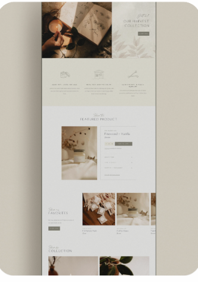
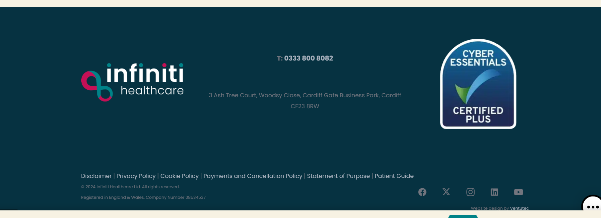
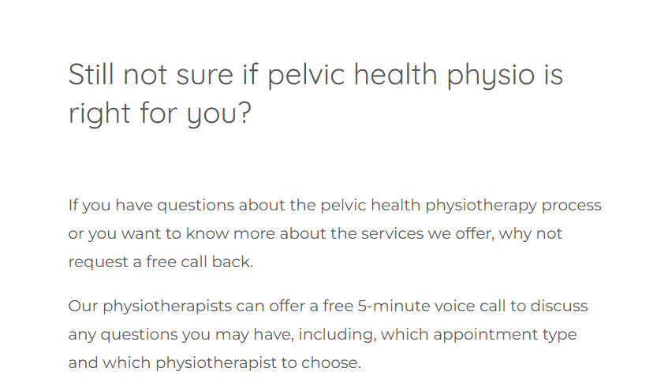

I like the above writing most for the title:

“Restore

Specialist Pelvic Health Physiotherapy “

Neutral minimalistic vibes

Can the below be added in somewhere to basically say I am HCPC and CSP
registered:

The logos for HCPC and CSP are:

**What do we offer? Female only clinic**

Urinary incontinence

Urine frequency & urgency

Pelvic organ prolapse

Pelvic pain

Pregnancy related pelvic girdle pain (PGP)

Dyspareunia (pain with intercourse)

Pelvic floor dysfunction (weakness/tightness)

Diastasis Recti (separation of abdominal muscle wall)

Postnatal recovery

Pelvic floor MOT (no symptoms)

**What is a pelvic floor MOT assessment?**

Ever wonder if everything is functioning as it should be? Want to learn
more about how your pelvis works?

This is a one-off specialist session designed for women who don’t
currently experience symptoms but want to take a proactive approach to
their pelvic health.

Many pelvic health issues develop over a long period of time, and can be
prevented. A pelvic floor MOT allows you to understand how your pelvic
floor is functioning now, and what you can do to maintain long term
health, as well as prevent future problems.

What this session includes:

- Internal vaginal examination to assess your pelvic floor

- Identifying any early signs of weakness, tension or dysfunction

- Core strength assessment

- Personalised advice/treatment plans tailored to your lifestyle

Most women only need a single session, with no ongoing treatment
required.

**Fees:**

Initial assessment (1 hour 30 minutes) £90

Initial assessment pelvic floor MOT only (1 hour) £80

Follow up (30 minutes) £60

Extended follow up (45 minutes) £75

**How to book? **

Booking system as you sent me on message but the box where it says “fave
species of bat” can you change to “What is the main reason you are
coming to physiotherapy? “

Then a drop down list:

Urinary incontinence

Urine frequency & urgency

Pelvic organ prolapse

Pelvic pain

Pregnancy related pelvic girdle pain (PGP)

Dyspareunia (pain with intercourse)

Pelvic floor dysfunction (weakness/tightness)

Diastasis Recti (separation of abdominal muscle wall)

Mixed symptoms

Other (space for them to make a comment)

**Only day I want available is Wednesday (0930-17:00)**

Can the below be put on so that when they book in they have to sign
this? And where will this then go to?

**Restore**

**Pelvic Health Physiotherapy – Privacy & Consent Form**

**🔹 Your Privacy Matters**

We respect your privacy. Your personal and sensitive health information
(including pelvic health details, medical history, and treatment notes)
is collected and stored securely to provide safe, effective
physiotherapy.

**Why we collect your information:**

- Provide personalised pelvic health assessment and treatment
- Manage appointments and communicate with you
- Maintain accurate and secure clinical records

**How we protect your information:**

- Records are securely stored electronically and/or on paper
- Only your physiotherapist has access to your information
- Data will not be shared without your consent, except when legally
  required or necessary for your care

**Your rights:**

- Access your records and request corrections
- Withdraw consent or request deletion (where legally allowed)
- Ask questions about how your data is used

**🔹 Consent to Treatment & Data Use**

**Client Name:** \_\_\_\_\_\_\_\_\_\_\_\_\_\_\_\_\_\_\_\_\_\_\_\_\_\_

**Date of Birth:** \_\_\_\_\_\_\_\_\_\_\_\_\_\_\_\_\_\_\_\_\_\_\_\_\_

I understand that Restore will collect and store sensitive personal and
health information relevant to pelvic health physiotherapy.

**I consent to:**

- Pelvic health assessment and treatment (including internal assessment
  if required)
- Collection, storage, and use of sensitive health information for my
  care
- Use of my information for appointment management, clinical records,
  and follow-up

**I understand that:**

- My information will be kept confidential and stored securely
- It will not be shared without my consent unless legally required or
  necessary for my care
- I can request access to my records or withdraw consent at any time
- Consent can be withdrawn at any point

**Client Signature:**
\_\_\_\_\_\_\_\_\_\_\_\_\_\_\_\_\_\_\_\_\_\_\_\_\_\_

**Date:** \_\_\_\_\_\_\_\_\_\_\_\_\_\_\_\_\_\_\_\_\_\_\_\_\_\_\_\_\_\_

Can the below be put in somewhere as the cancellation policy:

**Restore – Appointment & Cancellation Policy**

- Please give at least **24 hours’ notice** if you need to cancel or
  reschedule.
- **Late cancellations** (less than 24 hours) or **no-shows** will incur
  a fee for the full session cost.
- Emergencies or sudden illness are exceptions—please let us know as
  soon as possible.

**To cancel or reschedule:**

- Phone: 07429564579
- Email: restore.physio26@gmail.com

**Something like this at the end **

**Location: **

The Healthcare Hub

63 Taff Street

Pontypridd

CF37 4TD

Wales
